Below is a design flow diagram that extends the previous policy down to **actual Vue implementation units**. This is not a code change proposal, but rather a definition of how responsibilities, state, and events should flow during implementation.

---

# Common Premise: Popup State Model

If we maintain the URL as the basis for popup state, as in the current structure, it is stable to separate the popup state into the following 3 layers.

```text
1. Route state (shared · back navigation · deep link)
   └─ Which popup / which target to view
   └─ route.name, route.query

2. Popup session state (maintained only while open)
   └─ Current step, input values, loading, selected items, errors
   └─ ref / reactive

3. UI control state (common infrastructure)
   └─ Scroll lock, focus, ESC, backdrop, z-index
   └─ OverlayHost or ModalShell
```

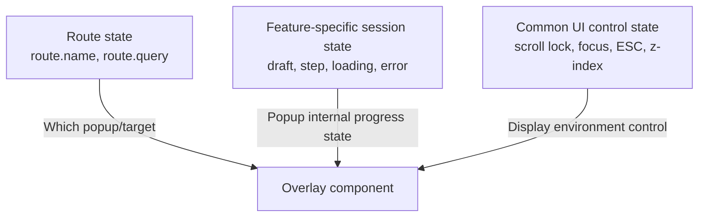

For example:

```text
/account?id=groom
  ├─ Route state: account, groom
  ├─ Session state: copied = false
  └─ UI state: body scroll locked

/guestbook
  ├─ Route state: guestbook
  ├─ Session state: action, step, draft, submitting, error
  └─ UI state: focus trap, ESC close, body scroll locked
```

---

# Policy A. Root Central `OverlayHost` Implementation Details

## Component Hierarchy

```text
App.vue
├─ InvitationContent
│  ├─ ContactSection
│  ├─ DirectionsSection
│  ├─ GiftSection
│  └─ GuestbookSection
│
├─ GlobalActions
│  ├─ ChatPill
│  └─ MusicButton
│
└─ OverlayHost
   └─ ModalShell
      ├─ AccountOverlay
      ├─ ChatOverlay
      ├─ ContactOverlay
      ├─ AddressOverlay
      ├─ PhoneOverlay
      └─ GuestbookOverlay
```

`OverlayHost` decides which popup to render, and `ModalShell` handles the common UI controls needed by all popups.

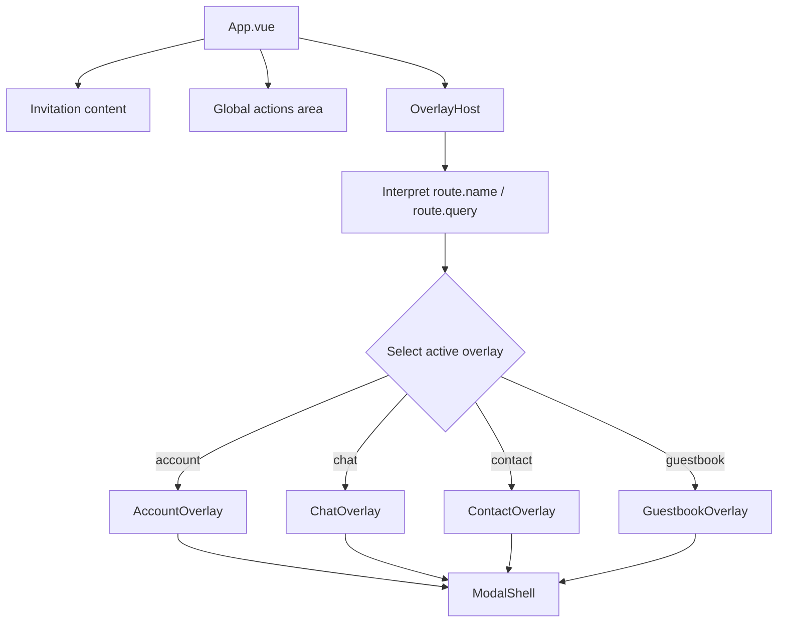

---

## Open Detailed Flow

Using the account popup as an example, the sequence is as follows.

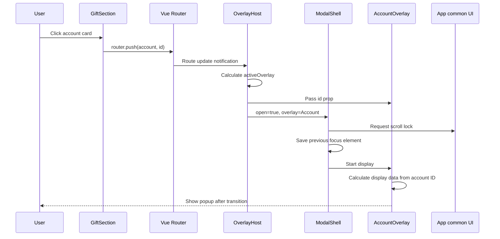

### Implementation Responsibilities of Each Layer

| Layer | Input | Output/Responsibility |
|---|---|---|
| `GiftSection` | User click | `router.push({ name: 'account', query: { id } })` |
| `OverlayHost` | `route.name`, `route.query` | Select active popup, compose required props |
| `ModalShell` | Open state, close callback | backdrop, scroll lock, ESC, focus trap, transition |
| `AccountOverlay` | `accountId` | Display account data, manage copy state |
| Router | Route change | Maintain URL/history |

---

## `OverlayHost` State Decision Flow

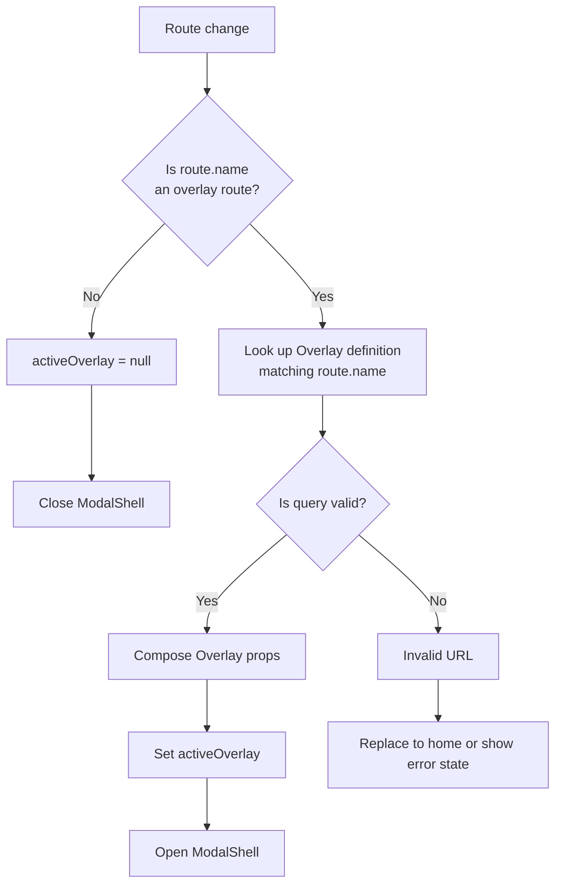

Here, **route validation** is important.

```text
/account?id=groom       → Normal
/account?id=unknown     → Target not found
/contact?who=bride      → Normal
/contact?who=invalid    → No decryption target
```

The current implementation may open a popup with invalid query in some popups, but the internal data may be empty. With the central host policy, this can be uniformly blocked at the route interpretation stage or branched to an error UI.

---

## Close Detailed Flow

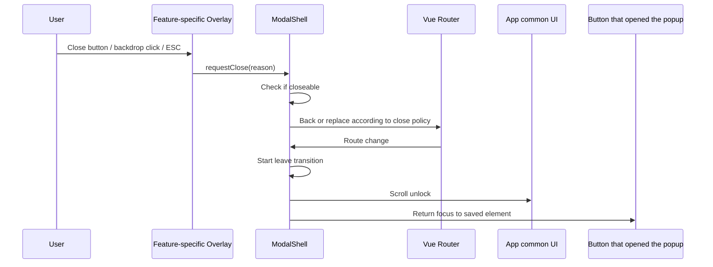

`reason` can be a simple string, but it allows for fine-grained follow-up policies.

```text
close button       → "close-button"
backdrop click     → "backdrop"
ESC                → "escape"
submit success     → "complete"
external route change → "route-change"
```

For example, clicking the backdrop while writing a guestbook entry can branch to a confirmation popup saying "You have unsaved content" instead of closing immediately.

---

## `ModalShell` Common Lifecycle

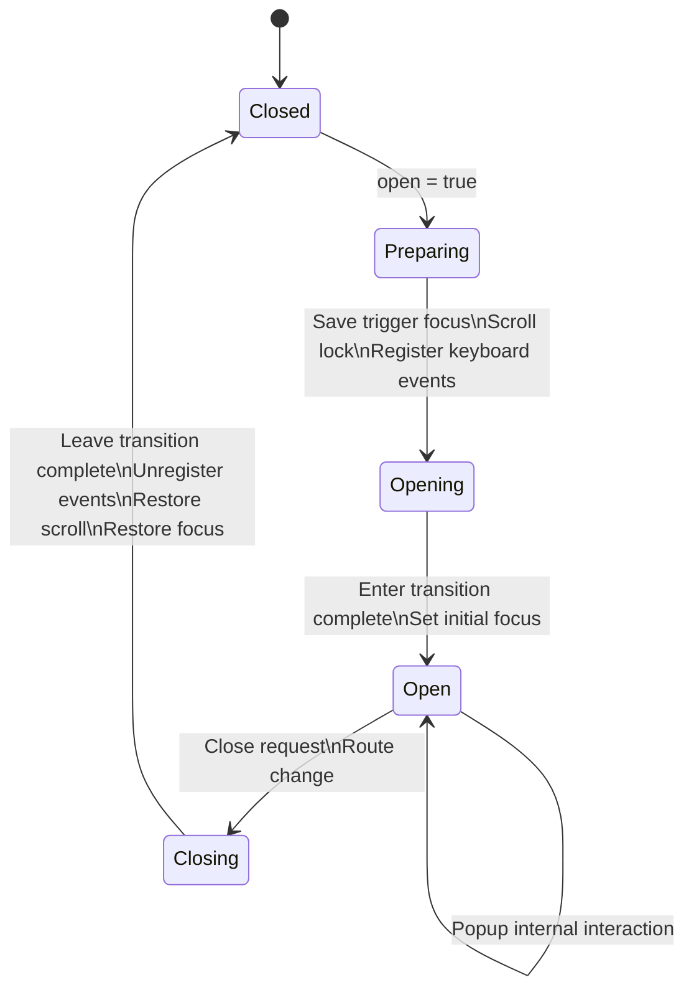

By consolidating the common control responsibilities in one place, each popup only needs to handle the following.

```text
- Data to display
- Domain features such as input, copy, save
- Whether it can be closed
- Cleanup needed after closing
```

---

# Policy B. Section Internal Overlay Implementation Details

This policy is a **structure where the trigger, data, session state, and popup UI are all within a single feature component**.

## Contact Popup State Flow

```mermaid
flowchart TD
    A[ContactSection rendering] --> B[Prepare people data]
    B --> C[Watch route.name]

    D[User clicks contact button] --> E[openContact(person)]
    E --> F[Set selectedPerson]
    F --> G[Execute decryptPhone]
    G --> H[Set displayedPhone]
    H --> I[router.push contact + who]

    I --> C
    C --> J{route.name = contact?}
    J -- Yes --> K[isContactOpen = true]
    K --> L[Render contact overlay]

    L --> M{User action}
    M -->|Call| N[tel link]
    M -->|Text| O[sms link]
    M -->|Copy| P[clipboard handling]
    M -->|Close| Q[router.replace home]

    Q --> C
    J -- No --> R[Reset selection/display/copy state]
```

### Implementation Points to Note in This Approach

#### 1. Keep the "Currently Selected Target" Based on Route

Currently, `selectedPerson` is set first after a click, and then the route is navigated. This is fast in terms of UI responsiveness, but results in two sources of truth for state.

```text
Local state: selectedPerson
URL state: route.query.who
```

When refining, the source of truth should be defined as follows.

```text
Route is the source of truth
  route.query.who
    → selectedPerson computed
    → Decryption/data load watcher
```

This way, data is prepared through the same flow for direct URL access, refresh, and browser back/forward navigation.

#### 2. Separate the Timing of State Initialization on Close

```text
Initialize immediately after route change
  Pros: No data residue
  Cons: Content may disappear first during leave transition

Initialize after leave transition completes
  Pros: Content is maintained during close animation
  Cons: Requires transition hook management
```

If there is flickering where content disappears, it is better to initialize the session state in `@after-leave`.

---

## Guestbook Multi-step Session Detailed Flow

For complex features like the guestbook, it is appropriate for the route to handle only "open state" and the local session to handle "current task state".

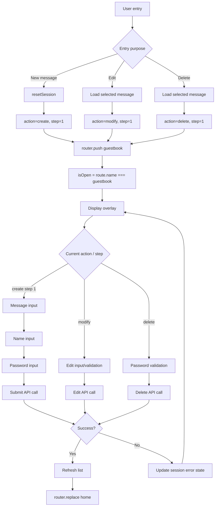

### Recommended Session State Classification

```text
Route state
  - isOpen: route.name === 'guestbook'

Task state
  - action: create | modify | delete
  - step: number
  - targetId: string | null

Input state
  - draft.message
  - draft.name
  - draft.password

Request state
  - submitting: boolean
  - error: string | null

UI state
  - focusedField
  - composing
  - longPressTriggered
```

By separating responsibilities this way, `close()` in principle only changes the route, and `resetSession()` is called either at the **new entry point** or at the **close transition completion point**, making it clear.

---

# Policy C. Section Logic + `Teleport` Implementation Details

This policy maintains the cohesion of the section's internal implementation while securing the stability of the modal DOM's global layer.

## Render Tree and State Ownership

```text
Actual Vue component ownership
ContactSection
  ├─ Contact list
  ├─ selectedPerson / displayedPhone
  ├─ openContact / closeOverlay
  └─ Teleport
      └─ ContactOverlay DOM

Actual browser DOM location
body
  └─ #overlay-root
      └─ ContactOverlay DOM
```

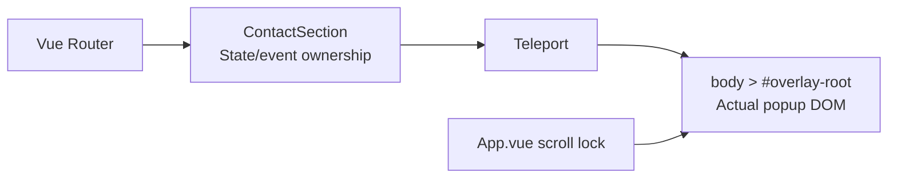

## Open/Close Sequence

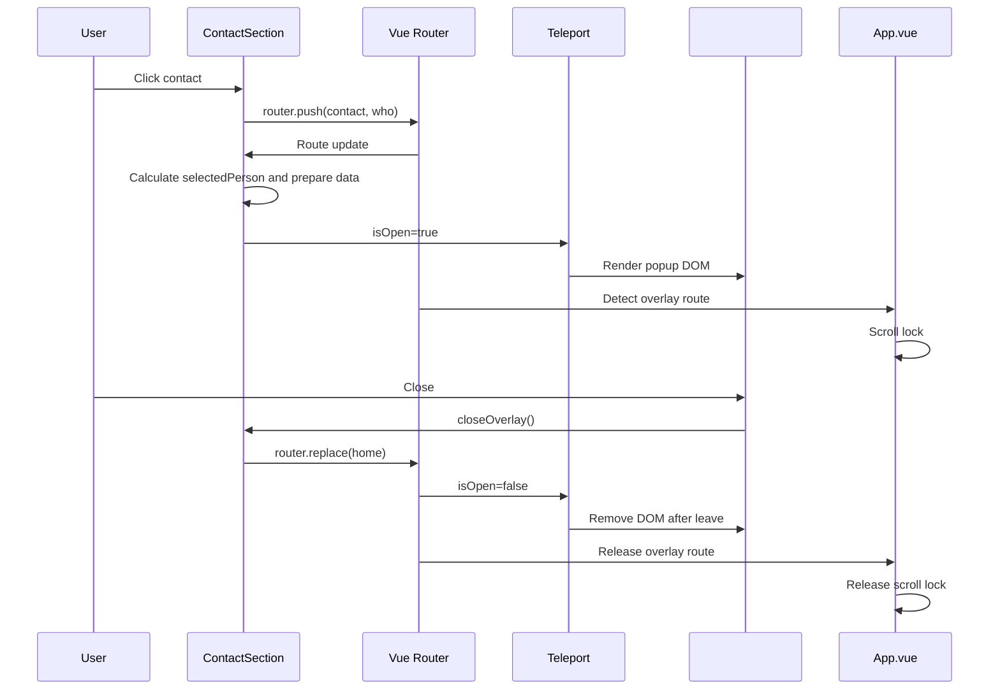

## Items to Decide Separately in `Teleport` Policy

```text
1. Target node
   - Use body directly
   - Use a dedicated #overlay-root node

2. Layer order
   - base content: 0
   - fixed global actions: 50
   - standard modal: 100
   - nested confirm modal: 200
   - toast: 300

3. Multiple popup allowance
   - Default: only one allowed
   - Exception: nested allowed, such as confirmation dialog during guestbook writing

4. Scroll lock owner
   - App.vue single owner
   - ModalShell single owner
   - Avoid per-popup individual ownership
```

---

# Policy D. `OverlayHost` + Common Registry Implementation Details

This policy is suitable when there are many screen-covering UIs. The key is to declaratively manage the mapping between routes and actual components.

## Overlay Definition Model

```text
OverlayDefinition
  - routeName: string
  - component: Vue component
  - getProps(route): object
  - closePolicy: back | replace-home | custom
  - scrollLock: boolean
  - closeOnBackdrop: boolean
  - closeOnEscape: boolean
  - restoreFocus: boolean
  - validate(route): boolean
```

A conceptual example is as follows.

```text
account
  routeName: "account"
  props: { accountId: route.query.id }
  closePolicy: "replace-home"
  closeOnBackdrop: true
  closeOnEscape: true

chat
  routeName: "chat"
  props: { topic: pendingChatTopic }
  closePolicy: "back-or-home"
  closeOnBackdrop: true
  closeOnEscape: true

guestbook
  routeName: "guestbook"
  props: {}
  closePolicy: "replace-home"
  closeOnBackdrop: false (confirmation needed while writing)
  closeOnEscape: conditional
```

## Route Interpretation → Popup Selection Process

```mermaid
flowchart TD
    A[Route change] --> B[Look up route.name in OverlayRegistry]
    B --> C{Does a definition exist?}

    C -- No --> D[No OverlayHost rendering]
    C -- Yes --> E[Validate route.query]

    E -- Fail --> F[Handle invalid popup URL]
    F --> G[Home redirect or error modal]

    E -- Pass --> H[getProps(route)]
    H --> I[Set activeOverlay]
    I --> J[Pass settings to ModalShell]
    J --> K[Dynamic component rendering]
```

## Common Close Policy Decision

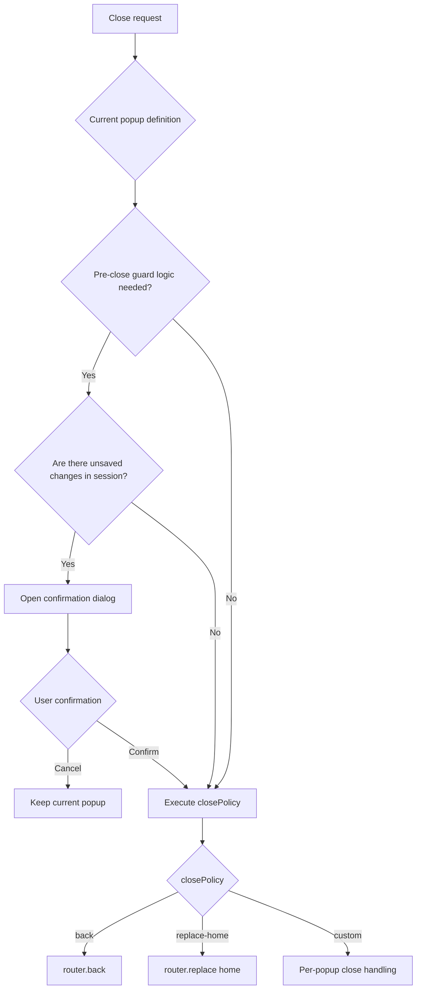

The guestbook may need to check "whether there is unsaved data", but the account copy popup or simple contact popup can be closed immediately.

---

# Decision Flow for Choosing Implementation Policy

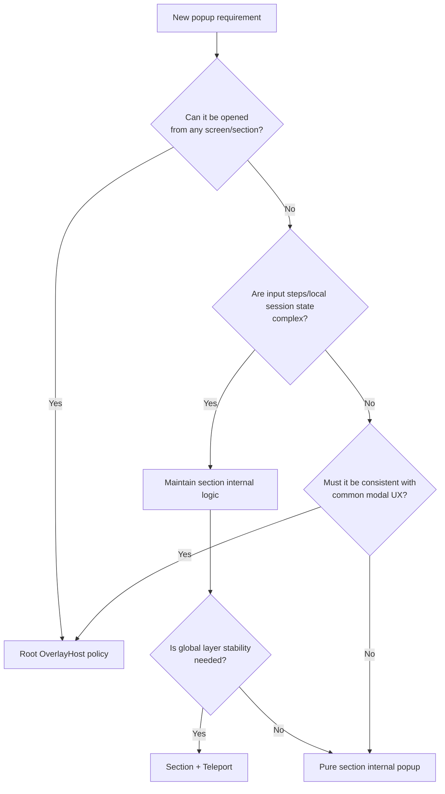

---

# Recommended Detailed Policy per Feature

| Feature | State ownership | Actual render location | Close policy | Remarks |
|---|---|---|---|---|
| Chat | `App` or chat composable | `OverlayHost` | `back-or-home` | Global pill, topic passing exists |
| Account | `AccountOverlay` | `OverlayHost` | `replace-home` | Simple view/copy |
| Contact | `ContactSection` | `Teleport → OverlayHost` | `replace-home` | Coupled with section data, global layer needed |
| Address/Phone | `DirectionsSection` | `Teleport → OverlayHost` | `replace-home` | Good candidate for common sheet |
| Guestbook | `GuestbookSection` or dedicated composable | `Teleport → OverlayHost` | Conditional close | Multi-step session and unsaved data considerations |
| Map | `DirectionsSection` | PhotoSwipe own portal | `router.replace(home)` | External library lifecycle coupling |

The core is as follows.

```text
The route handles "what was opened",
the feature component handles "what to do in the popup",
and the common overlay layer handles "how to safely and consistently cover the screen".
```
