아래는 앞선 정책을 **실제 Vue 구현 단위**까지 내려 확장한 설계 흐름도입니다. 코드 변경 제안이 아니라, 구현 시 책임·상태·이벤트가 어떻게 흘러야 하는지를 정의한 내용입니다.

---

# 공통 전제: 팝업 상태 모델

현재 구조처럼 URL을 팝업 상태의 기준으로 유지한다면, 팝업 상태는 다음 3계층으로 분리하는 것이 안정적입니다.

```text
1. 라우트 상태 (공유·뒤로가기·딥링크)
   └─ 어떤 팝업인가 / 어떤 대상을 볼 것인가
   └─ route.name, route.query

2. 팝업 세션 상태 (열린 동안만 유지)
   └─ 현재 단계, 입력값, 로딩, 선택 항목, 오류
   └─ ref / reactive

3. UI 제어 상태 (공통 인프라)
   └─ 스크롤 잠금, 포커스, ESC, backdrop, z-index
   └─ OverlayHost 또는 ModalShell
```

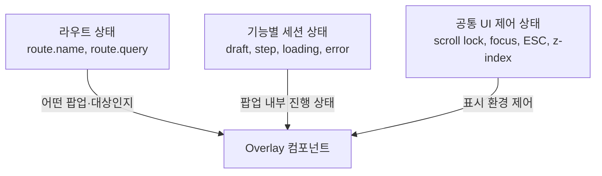

예를 들면:

```text
/account?id=groom
  ├─ 라우트 상태: account, groom
  ├─ 세션 상태: copied = false
  └─ UI 상태: body scroll locked

/guestbook
  ├─ 라우트 상태: guestbook
  ├─ 세션 상태: action, step, draft, submitting, error
  └─ UI 상태: focus trap, ESC close, body scroll locked
```

---

# 정책 A. 루트 중앙 `OverlayHost` 구현 상세

## 컴포넌트 계층

```text
App.vue
├─ InvitationContent
│  ├─ ContactSection
│  ├─ DirectionsSection
│  ├─ GiftSection
│  └─ GuestbookSection
│
├─ GlobalActions
│  ├─ ChatPill
│  └─ MusicButton
│
└─ OverlayHost
   └─ ModalShell
      ├─ AccountOverlay
      ├─ ChatOverlay
      ├─ ContactOverlay
      ├─ AddressOverlay
      ├─ PhoneOverlay
      └─ GuestbookOverlay
```

`OverlayHost`는 어떤 팝업을 그릴지 결정하고, `ModalShell`은 모든 팝업이 공통으로 필요한 UI 제어를 담당하는 구조입니다.

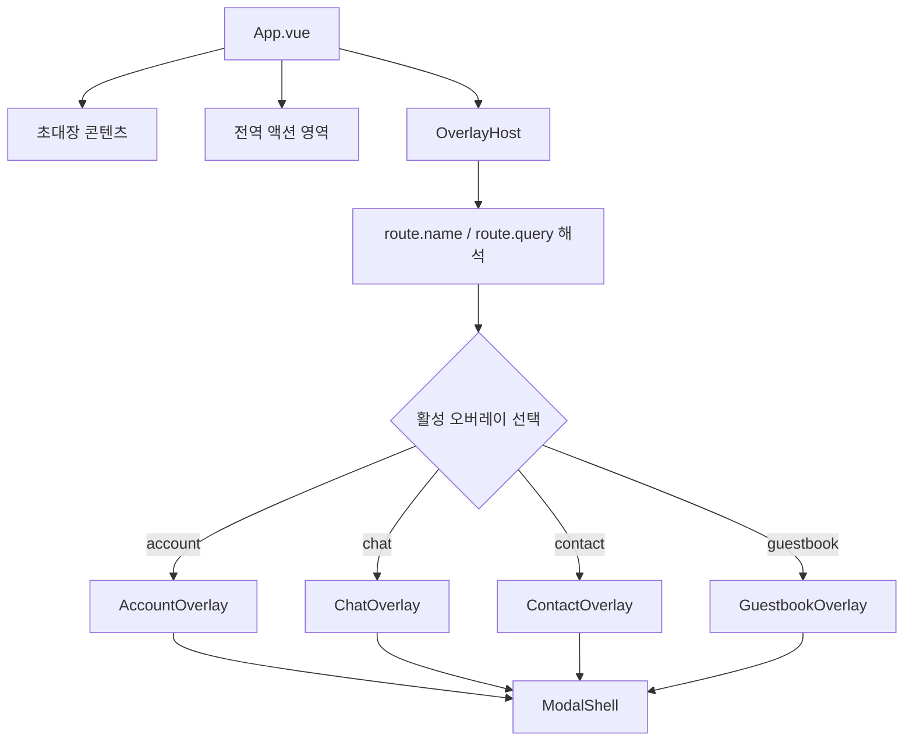

---

## 열기 상세 흐름

계좌 팝업을 예시로 하면 다음과 같은 순서입니다.

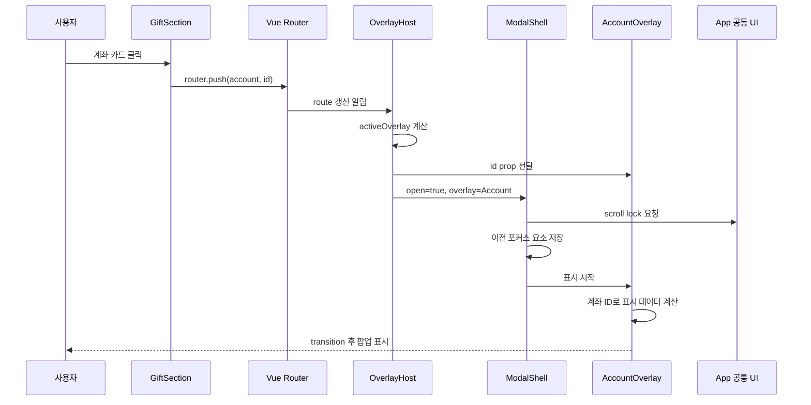

### 각 계층의 구현 책임

| 계층 | 입력 | 출력/책임 |
|---|---|---|
| `GiftSection` | 사용자 클릭 | `router.push({ name: 'account', query: { id } })` |
| `OverlayHost` | `route.name`, `route.query` | 활성 팝업 선택, 필요한 props 구성 |
| `ModalShell` | 열림 여부, 닫기 콜백 | backdrop, scroll lock, ESC, focus trap, transition |
| `AccountOverlay` | `accountId` | 계좌 데이터 표시, 복사 상태 관리 |
| Router | route 변경 | URL·히스토리 유지 |

---

## `OverlayHost`의 상태 결정 흐름

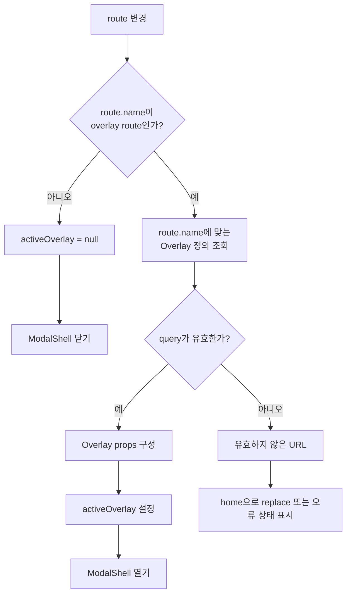

여기서 **라우트 유효성 검증**이 중요합니다.

```text
/account?id=groom       → 정상
/account?id=unknown     → 대상 없음
/contact?who=bride      → 정상
/contact?who=invalid    → 복호화 대상 없음
```

현재 구현은 일부 팝업에서 유효하지 않은 query일 때 팝업이 열리지만 내부 데이터가 비어 있을 수 있습니다. 중앙 호스트 정책에서는 라우트 해석 단계에서 이를 통일적으로 차단하거나 오류 UI로 분기할 수 있습니다.

---

## 닫기 상세 흐름

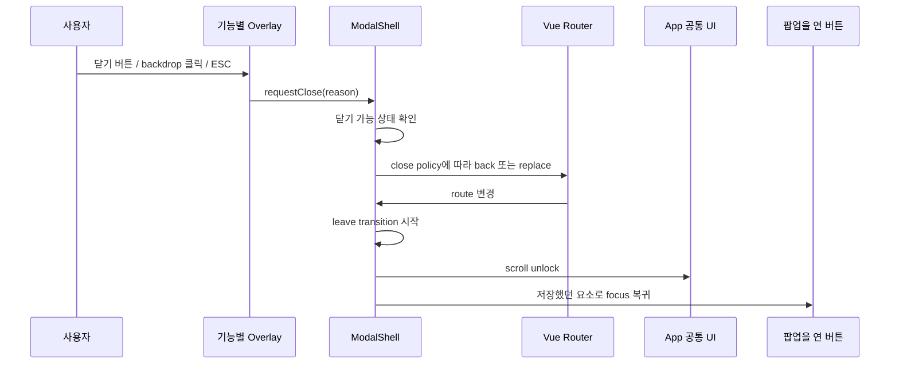

`reason`은 단순 문자열이어도 후속 정책을 세밀하게 만들 수 있습니다.

```text
close 버튼       → "close-button"
배경 클릭        → "backdrop"
ESC              → "escape"
등록 성공        → "complete"
외부 라우트 변경 → "route-change"
```

예를 들어 방명록 작성 중 backdrop 클릭은 즉시 닫지 않고, “작성 중인 내용이 있습니다” 확인 팝업으로 분기할 수 있습니다.

---

## `ModalShell` 공통 라이프사이클

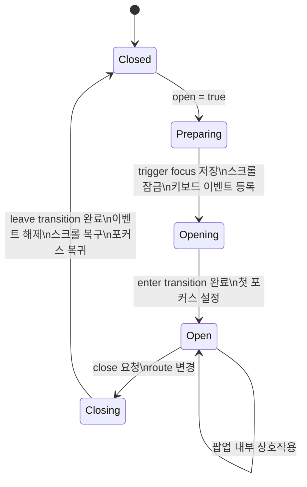

공통 제어의 책임을 한 곳에 모으면 각 팝업은 아래만 신경 쓰면 됩니다.

```text
- 표시할 데이터
- 입력·복사·저장 등 도메인 기능
- 닫아도 되는지 여부
- 닫힌 이후 필요한 정리
```

---

# 정책 B. 섹션 내부 오버레이 구현 상세

이 정책은 **트리거, 데이터, 세션 상태, 팝업 UI가 하나의 기능 컴포넌트 안에 있는 구조**입니다.

## 연락처 팝업의 상태 흐름

```mermaid
flowchart TD
    A[ContactSection 렌더링] --> B[people 데이터 준비]
    B --> C[route.name 감시]

    D[사용자가 연락처 버튼 클릭] --> E[openContact(person)]
    E --> F[selectedPerson 설정]
    F --> G[decryptPhone 실행]
    G --> H[displayedPhone 설정]
    H --> I[router.push contact + who]

    I --> C
    C --> J{route.name = contact?}
    J -- 예 --> K[isContactOpen = true]
    K --> L[contact overlay 렌더링]

    L --> M{사용자 액션}
    M -->|전화| N[tel 링크]
    M -->|문자| O[sms 링크]
    M -->|복사| P[clipboard 처리]
    M -->|닫기| Q[router.replace home]

    Q --> C
    J -- 아니오 --> R[선택·표시·복사 상태 초기화]
```

### 이 방식에서 주의할 구현 포인트

#### 1. “현재 선택 대상”의 기준을 라우트로 유지

현재는 클릭 직후 `selectedPerson`을 먼저 설정하고, 그 다음 라우트를 이동합니다. 이는 UI 반응성 측면에서는 빠르지만, 상태 기준이 둘이 됩니다.

```text
로컬 상태: selectedPerson
URL 상태: route.query.who
```

고도화 시 기준을 다음처럼 정해야 합니다.

```text
라우트가 진실의 원천(source of truth)
  route.query.who
    → selectedPerson computed
    → 복호화·데이터 로드 watcher
```

이렇게 하면 직접 URL 접근, 새로고침, 브라우저 앞/뒤 이동에도 같은 흐름으로 데이터가 준비됩니다.

#### 2. 닫힐 때 상태 초기화 시점 분리

```text
라우트 변경 직후 초기화
  장점: 데이터 잔류가 없음
  단점: leave transition 중 내용이 먼저 사라질 수 있음

leave transition 완료 후 초기화
  장점: 닫힘 애니메이션 동안 콘텐츠 유지
  단점: transition hook 관리 필요
```

내용이 사라지는 깜빡임이 있다면 `@after-leave`에서 세션 상태를 초기화하는 편이 좋습니다.

---

## 방명록 다단계 세션의 상세 흐름

방명록처럼 기능 자체가 복잡한 경우, 라우트는 “열림 여부”만, 로컬 세션은 “현재 업무 상태”를 담당하는 것이 적절합니다.

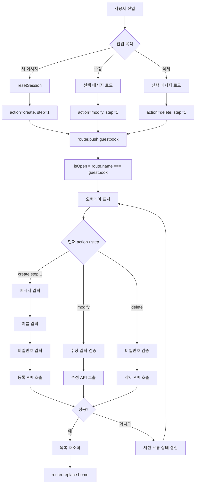

### 세션 상태 권장 분류

```text
라우트 상태
  - isOpen: route.name === 'guestbook'

업무 상태
  - action: create | modify | delete
  - step: number
  - targetId: string | null

입력 상태
  - draft.message
  - draft.name
  - draft.password

요청 상태
  - submitting: boolean
  - error: string | null

UI 상태
  - focusedField
  - composing
  - longPressTriggered
```

이렇게 역할을 분리하면 `close()`는 원칙적으로 route만 바꾸고, `resetSession()`은 **새 진입 시점** 또는 **닫힘 transition 완료 시점**에 호출하는 방식으로 명확해집니다.

---

# 정책 C. 섹션 로직 + `Teleport` 구현 상세

이 정책은 섹션 내부 구현의 응집도를 유지하면서도, 모달 DOM의 전역 레이어 안정성을 확보하는 방식입니다.

## 렌더 트리와 상태 소유권

```text
실제 Vue 컴포넌트 소속
ContactSection
  ├─ 연락처 목록
  ├─ selectedPerson / displayedPhone
  ├─ openContact / closeOverlay
  └─ Teleport
      └─ ContactOverlay DOM

실제 브라우저 DOM 위치
body
  └─ #overlay-root
      └─ ContactOverlay DOM
```

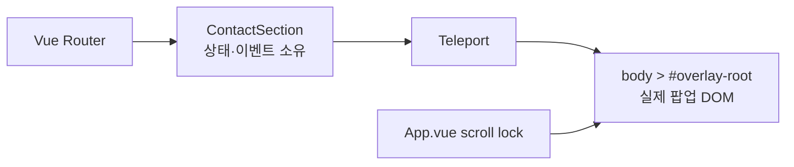

## 열기/닫기 시퀀스

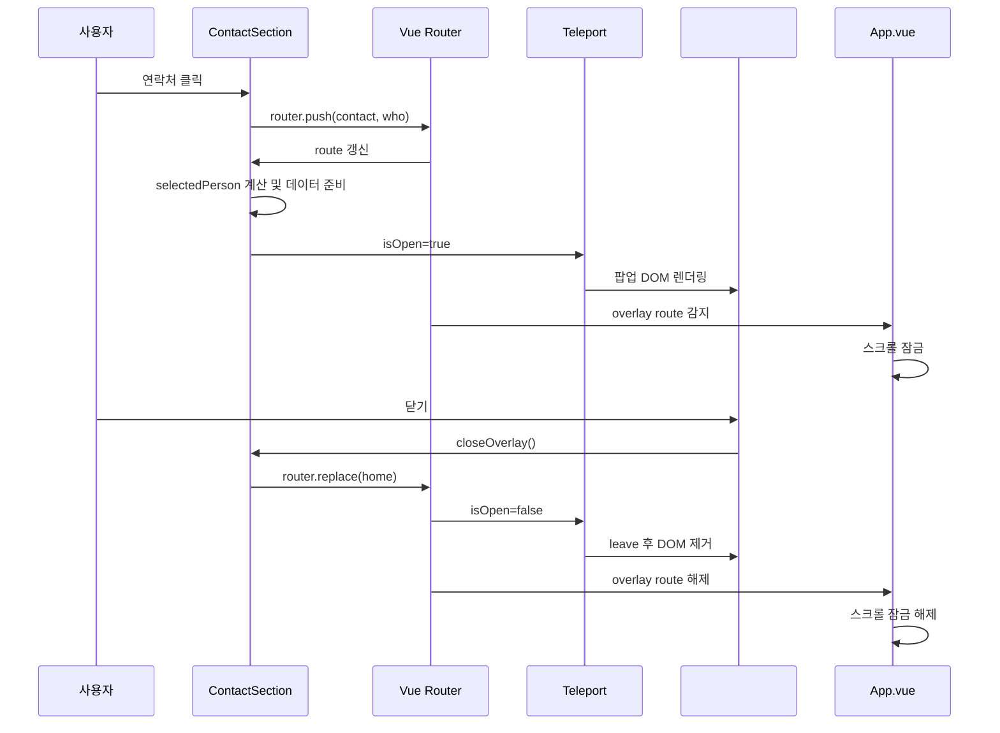

## `Teleport` 정책에서 별도로 결정할 항목

```text
1. 대상 노드
   - body 직접 사용
   - #overlay-root 전용 노드 사용

2. 레이어 순서
   - base content: 0
   - fixed global actions: 50
   - standard modal: 100
   - nested confirm modal: 200
   - toast: 300

3. 다중 팝업 허용 여부
   - 기본: 하나만 허용
   - 예외: 방명록 작성 중 확인 다이얼로그처럼 중첩 허용

4. 스크롤 잠금 소유자
   - App.vue 단일 소유
   - ModalShell 단일 소유
   - 팝업별 개별 소유는 지양
```

---

# 정책 D. `OverlayHost` + 공통 레지스트리 구현 상세

이 정책은 화면 덮개 UI가 많아졌을 때 적합합니다. 핵심은 라우트와 실제 컴포넌트의 매핑을 선언적으로 관리하는 것입니다.

## 오버레이 정의 모델

```text
OverlayDefinition
  - routeName: string
  - component: Vue component
  - getProps(route): object
  - closePolicy: back | replace-home | custom
  - scrollLock: boolean
  - closeOnBackdrop: boolean
  - closeOnEscape: boolean
  - restoreFocus: boolean
  - validate(route): boolean
```

개념적 예시는 다음과 같습니다.

```text
account
  routeName: "account"
  props: { accountId: route.query.id }
  closePolicy: "replace-home"
  closeOnBackdrop: true
  closeOnEscape: true

chat
  routeName: "chat"
  props: { topic: pendingChatTopic }
  closePolicy: "back-or-home"
  closeOnBackdrop: true
  closeOnEscape: true

guestbook
  routeName: "guestbook"
  props: {}
  closePolicy: "replace-home"
  closeOnBackdrop: false (작성 중에는 확인 필요)
  closeOnEscape: conditional
```

## 라우트 해석 → 팝업 선택 과정

```mermaid
flowchart TD
    A[route 변경] --> B[OverlayRegistry에서 route.name 조회]
    B --> C{정의가 있는가?}

    C -- 없음 --> D[OverlayHost 렌더링 없음]
    C -- 있음 --> E[validate route.query]

    E -- 실패 --> F[잘못된 팝업 URL 처리]
    F --> G[home redirect 또는 오류 모달]

    E -- 성공 --> H[getProps(route)]
    H --> I[activeOverlay 설정]
    I --> J[ModalShell에 설정 전달]
    J --> K[동적 component 렌더링]
```

## 공통 닫기 정책 결정

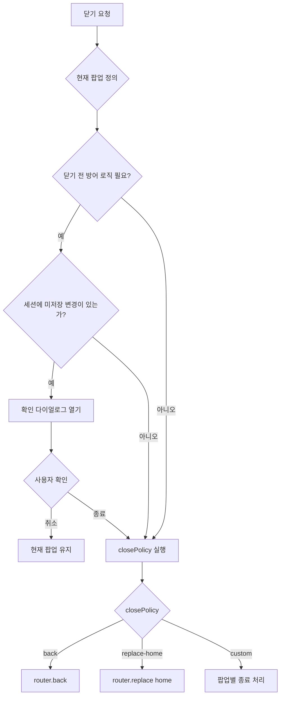

방명록은 “작성 중 데이터 존재 여부”를 검사해야 할 수 있지만, 계좌 복사 팝업이나 단순 연락처 팝업은 즉시 닫아도 됩니다.

---

# 구현 정책 선택을 위한 의사결정 흐름

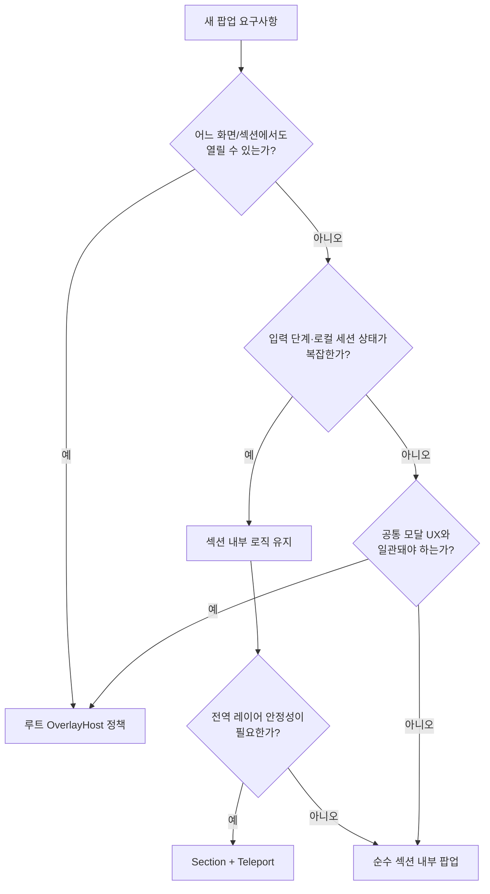

---

# 현재 기능별 권장 세부 정책

| 기능 | 상태 소유 | 실제 렌더 위치 | 닫기 정책 | 비고 |
|---|---|---|---|---|
| 채팅 | `App` 또는 채팅 composable | `OverlayHost` | `back-or-home` | 전역 pill, topic 전달 존재 |
| 계좌 | `AccountOverlay` | `OverlayHost` | `replace-home` | 단순 조회·복사 |
| 연락처 | `ContactSection` | `Teleport → OverlayHost` | `replace-home` | 섹션 데이터와 결합, 전역 레이어 필요 |
| 주소/전화 | `DirectionsSection` | `Teleport → OverlayHost` | `replace-home` | 공통 시트화하기 좋은 대상 |
| 방명록 | `GuestbookSection` 또는 전용 composable | `Teleport → OverlayHost` | 조건부 닫기 | 다단계 세션과 미저장 데이터 고려 |
| 약도 | `DirectionsSection` | PhotoSwipe 자체 포털 | `router.replace(home)` | 외부 라이브러리 lifecycle 결합 |

핵심은 다음과 같습니다.

```text
라우트는 “무엇을 열었는가”를 담당하고,
기능 컴포넌트는 “팝업에서 무엇을 하는가”를 담당하며,
공통 오버레이 계층은 “어떻게 안전하고 일관되게 화면을 덮는가”를 담당합니다.
```